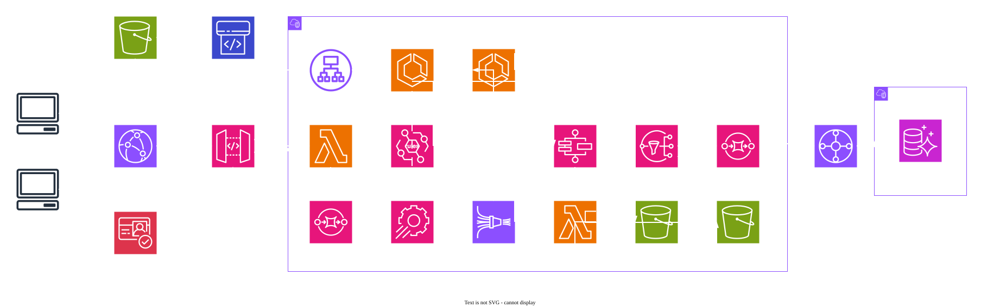

# GridLine — Test Project

**Document:** Test Project  
**Region:** `eu-central-1` (**mandatory**)  
**Duration:** Single 6-hour module

## Contents

1. [Task description](#1-task-description)
2. [Background](#2-background)
3. [Initial state](#3-initial-state)
4. [Architecture](#4-architecture)
5. [Stages](#5-stages)
6. [Tasks](#6-tasks)
7. [Common requirements](#71-common-requirements)
8. [Technical details](#8-technical-details)
9. [Service details](#9-service-details)
10. [Reference documents](#10-reference-documents)

---

## 1. Task Description

Rebuild GridLine's on-site race timing stack as a **cloud-native** architecture on AWS.

You must deliver:

1. **Authenticated public APIs backed by Amazon ECS** — race scheduling and live standings for directors and spectators.
2. **Transponder lap ingestion** — record every start/finish line crossing without loss.
3. **Runtime timing rules** — change validation thresholds without redeploying applications.
4. **A timed heat workflow** — start a heat, run for the configured duration, finalize results and notify stakeholders.
5. **A lap event stream** — durable analytics copy of every recorded crossing.
6. **CI/CD for the operations console** — uploading the console package alone completes deployment.

Marking is based on **functional verification**, **latency targets**, and **policy validation**.

---

## 2. Background

**GridLine** runs **six kart circuits** (four indoor, two outdoor). Each track has a start/finish transponder loop. Race directors schedule **heats** (8–12 karts); team managers and spectators watch live standings until the chequered flag.

### Problems (on-site rack stack)

- The timing PC crashed mid-finals and **lost 14 minutes** of lap data — standings had to be reconstructed by hand.
- Wet-track rule changes required editing a local config file and **restarting both timing services** during a live heat.
- Anyone on venue Wi‑Fi could POST fake laps to the timing API — one prank heat scrambled the junior final standings.
- Heat start/stop was manual; a late “stop recording” once included **two extra laps** in official results.
- Historical lap exports lived on a USB stick; post-event analytics took **days** to merge.

### Strategic goals

| Goal | Intent |
| ---- | ------ |
| Durable lap capture | Every transponder crossing persisted before acknowledgement |
| Runtime rule changes | Adjust lap validation without redeploying containers |
| Role-based access | Only directors mutate heats; spectators read standings |
| Automated heat window | Running heats close on schedule; results exported automatically |
| Analytics-ready history | Stream laps to durable storage for downstream analysis |
| Network isolation | Database reachable only from application networks over approved paths |
| Automated console delivery | Repeatable static releases |

### Target AWS building blocks

| Area | Services |
| ---- | -------- |
| Containers | Amazon ECS on AWS Fargate |
| Serverless | API Gateway, Lambda, AWS Step Functions |
| Identity | Amazon Cognito (console), `race-api` role enforcement on `/api/*` |
| Configuration | AWS AppConfig |
| Data | Aurora PostgreSQL, Amazon S3 |
| Streaming | Amazon Data Firehose |
| Orchestration | Amazon EventBridge |
| Messaging | Amazon SNS, Amazon SQS |
| Networking | AWS Transit Gateway |
| CDN | CloudFront |
| Delivery | CodePipeline, CodeBuild |

---

## 3. Initial State

You start from an **empty AWS account** (default VPC only). Nothing is pre-provisioned; you create every resource — including IAM roles, VPCs, Transit Gateway, CloudFront, Cognito, and the console pipeline.

An architecture diagram is provided **for reference only** (§4).

**Provided artifacts** (`game-assets/` — local files only; not uploaded for you):

| Artifact | Notes |
| -------- | ----- |
| `race-api` | Application binary |
| `timing-engine` | Application binary |
| `console.zip` | Operations console (static) |
| `init.sql` | Aurora schema and seed data |
| `finalize-heat.zip` | Lambda deployment package (heat finalization handler) |
| `runtime-config.json` | AppConfig bootstrap document |
| `rules-baseline.json` / `rules-wet-track.json` | Timing rule documents |
| `demo-users.txt` | Suggested Cognito users (director / spectator) |

> **CAUTION:** Use the **`eu-central-1`** region.

---

## 4. Architecture



*[Figure] Target architecture overview (for reference only)*

### Flow summary

| Stage | Path |
| ----- | ---- |
| Edge & identity | Cognito (console) → CloudFront → API Gateway → ALB → `race-api` (auth on `/api/*`); console from S3 (`/`) |
| Lap ingest | CloudFront → `POST /transponder` → API Gateway → Lambda → Aurora; enqueue `lap-events` → timing-engine |
| Live standings | timing-engine consumes SQS, updates Aurora, publishes each lap to Firehose |
| Heat APIs | Authenticated directors create/start heats via `race-api` |
| Heat workflow | `race-api` → EventBridge → Step Functions → Wait → `finalize-heat` → SNS → notifications queue |
| Analytics | Firehose → S3 data lake (`laps/` prefix) |
| Telemetry | `finalize-heat` → S3 `telemetry/{heat_id}.json` |
| Database | ECS + Lambda → Transit Gateway → Aurora (`data-vpc`) |
| Configuration | AppConfig → ECS tasks |
| Console CI/CD | S3 (source) → CodePipeline → CodeBuild → S3 (console) ← CloudFront |

**Networking:** application resources in **`track-vpc`**; Aurora only in **`data-vpc`**. Connect the two with **Transit Gateway**.

---

## 5. Stages

### Stage 1 — Identity, edge, configuration, and lap ingestion

Race directors and spectators sign in with **Cognito** in the console. Protected **`/api/*`** routes are enforced by the provided **`race-api`** binary (Bearer JWT from Cognito for console users; see §9.1). API Gateway forwards API traffic to `race-api` — do **not** attach a Cognito JWT authorizer on the HTTP API (the provided binary performs auth).

Transponders POST line crossings to **`POST /transponder`** (no JWT — hardware path). The Lambda validates against active **AppConfig** timing rules, inserts into Aurora, and enqueues a lap event.

Publish provided configuration documents through **AppConfig**. Provided ECS applications must pick up rule changes without redeployment. Invalid rule documents must not reach production.

### Stage 2 — Race API, timing engine, and database

**ECS (Fargate)** hosts:

- **`race-api`** — heats, tracks, standings; publishes heat lifecycle events to **EventBridge**; connects to Aurora via Secrets Manager; non-secret settings from AppConfig (§9.2).
- **`timing-engine`** — consumes `lap-events`, recalculates gaps/positions, writes to Aurora, and forwards each lap record to **Firehose**; must not be reachable from the public internet.

Aurora PostgreSQL runs only in `data-vpc`. All application and Lambda database traffic crosses the **Transit Gateway**.

### Stage 3 — Heat workflow, notifications, analytics, and console CI/CD

Starting a heat publishes a **`HeatStartRequested`** event. **Step Functions** drives the heat window:

1. Mark the heat **`RUNNING`**.
2. **Wait** for the configured duration (no task token).
3. Invoke **`finalize-heat`**, which writes §9.8 telemetry and marks the heat **`FINISHED`**.
4. Publish a notification to **SNS** (subscribed SQS queue for marking).

Upload `console.zip` to the pipeline source bucket; **CodePipeline** / **CodeBuild** publish the static site and invalidate CloudFront.

---

## 6. Tasks

1. **Networking**
   - Create **`data-vpc`** (Aurora only) and **`track-vpc`** (everything else).
   - Inter-VPC database access via **Transit Gateway** only.
2. **Identity and API edge**
   - Directors and spectators must authenticate before protected routes.
   - Unauthenticated calls to mutating routes must fail; liveness and transponder ingest may remain public.
   - Role separation between `director` and `spectator` (see §9.1).
3. **Configuration**
   - Publish provided timing rule documents through AppConfig.
   - Provided ECS tasks must consume configuration without redeployment.
   - Invalid rule documents must not reach production hosts.
4. **Transponder ingestion**
   - API Gateway + Lambda on **`POST /transponder`** (also reachable through CloudFront).
   - Validate against active AppConfig rules before insert.
   - Persist every valid crossing to Aurora before returning success.
   - Enqueue a lap event for the timing engine (shape in §9.5).
   - Responses: **`202`** success; **`400`** missing fields; **`422`** if heat is not `RUNNING`, transponder unknown, or lap fails rule validation.
5. **ECS**
   - Fargate cluster with `race-api` (public via ALB; app-layer auth) and `timing-engine` (private).
   - `timing-engine` must not be exposed on the public internet.
6. **Database**
   - Aurora PostgreSQL cluster (Serverless v2 or provisioned — your choice).
   - Load schema from `init.sql`.
   - Credentials **only** via Secrets Manager (managed master password acceptable).
7. **Heat workflow**
   - EventBridge-triggered Step Functions behaviour in §9.7.
   - Only authenticated **directors** may create or start heats.
8. **Notifications**
   - Heat completion publishes to SNS; marking reads from a subscribed SQS queue (§9.9).
9. **Analytics pipeline**
   - `timing-engine` → Firehose → S3 data lake (`laps/` prefix, schema §9.6).
10. **Telemetry**
    - S3 bucket for heat summaries (`telemetry/` prefix).
    - Object key: `telemetry/{heat_id}.json` (schema in §9.8).
11. **CDN**
    - One CloudFront distribution for console and APIs (paths in §9.10).
12. **Pipelines**
    - Console: uploading `console.zip` alone completes deployment (incl. CloudFront invalidation).
13. **Scalability**
    - Absorb race-day bursts; scale down when load subsides.

---

## 7.1 Common Requirements

| Theme | Expectation |
| ----- | ----------- |
| Security | System must be secure |
| Observability | Strong logging/monitoring earns extra credit |
| Cost | Prefer cost-effective designs |
| Resilience | Design for “chaos attacks” |
| Latency | Leaderboard reads within **0.3 seconds** at p95; other APIs within **0.5 seconds** at p95 |
| Caching | Use caching where it improves hit rate / performance |

---

## 8. Technical Details

1. All resources in **`eu-central-1`**.
2. You start from an **empty account**; no bootstrap or provisioning script is provided.
3. Do **not** modify provided application binaries, `console.zip`, configuration JSON, or the `finalize-heat` deployment package.
4. A Dockerfile is **not** provided — write your own to containerize each binary.
5. Compute for the provided applications: **Amazon ECS**, **Fargate**, **`linux/arm64`**.
6. Inter-VPC connectivity for the database path must use a **Transit Gateway**.
7. Database engine: **Aurora PostgreSQL** (not standalone RDS).
8. **`timing-engine`** must not be reachable from the public internet.
9. Application configuration (non-secret) must come from **AppConfig**; database credentials from **Secrets Manager**.
10. Exact resource names/placement are flexible; **security** and **availability** are assessed.
11. Data stores: Aurora and the S3 data lake. After `init.sql`, **do not** mutate data via console/CLI — only through applications and workflows.
12. Marking uses the **final** resource state; do not modify or delete resources during marking.
13. Protected `/api/*` routes must return **401** without credentials and enforce `director` / `spectator` roles (**403** where applicable). Auth is implemented in **`race-api`** (`GRID_DEV_AUTH=1` for platform checks — §9.1); do not require an API Gateway JWT authorizer.

---

## 9. Service Details

### 9.1 Identity

| Item | Requirement |
| ---- | ----------- |
| User pool | Cognito; app client for the console |
| Groups | `director`, `spectator` |
| API auth | Enforced by **`race-api`** on protected `/api/*` (not API Gateway JWT authorizer) |
| Public | `GET /health` and `POST /transponder` may be open |

Seed users (passwords in `game-assets/demo-users.txt`): one director, one spectator.

| Route | `director` | `spectator` |
| ----- | ---------- | ----------- |
| `POST /api/heats` | yes | no → **403** |
| `POST /api/heats/{id}/start` | yes | no → **403** |
| `GET /api/heats/{id}/leaderboard` | yes | yes |
| `GET /api/tracks` | yes | yes |

**Automated scoring auth:** Platform API checks do **not** use Cognito. They authenticate with mock headers on protected routes:

| Header | Example value |
| ------ | ------------- |
| `X-Dev-Sub` | `scoring-spectator`, `scoring-director` |
| `X-Dev-Groups` | `spectator` or `director` |

Set `GRID_DEV_AUTH=1` on `race-api` so the provided binary accepts these headers. The console and other clients use Cognito Bearer JWTs as usual.

### 9.2 Configuration (AppConfig)

Publish the provided JSON documents through **AppConfig** (with validation). Non-secret runtime values and timing rules come from AppConfig for **provided ECS applications**; **database credentials from Secrets Manager only**.

**Runtime document** (`runtime-config.json`):

| Field | Consumer |
| ----- | -------- |
| `DB_HOST` | ECS (`race-api`, `timing-engine`) |
| `DB_PORT` | ECS |
| `DB_NAME` | ECS |
| `EVENT_BUS_NAME` | `race-api` |
| `LAP_STREAM_NAME` | `timing-engine` |
| `STATE_MACHINE_ARN` | `race-api` (optional) |
| `SQS_QUEUE_URL` | `timing-engine` |

**Timing rules document** (separate profile; provided as `rules-baseline.json` / `rules-wet-track.json`):

| Field | Notes |
| ----- | ----- |
| `version` | e.g. `baseline-2026` |
| `min_lap_ms` | Laps faster → **422** |
| `max_lap_ms` | Laps slower → **422** |
| `reject_unknown_transponder` | When true, unknown IDs → **422** |
| `flags` | e.g. `{"wet_track": false}` |

The transponder Lambda must stamp `rules_version` on each accepted lap (Aurora column and Firehose record).

**AppConfig wiring** (provided ECS application containers):

| Variable | Purpose |
| -------- | ------- |
| `APPCONFIG_APPLICATION` | AppConfig application name |
| `APPCONFIG_ENVIRONMENT` | AppConfig environment name |
| `APPCONFIG_RUNTIME_CONFIGURATION` | Configuration profile for `runtime-config.json` |
| `APPCONFIG_RULES_CONFIGURATION` | Configuration profile for timing rules |

Runtime profile fields map to same-named **environment variables** (for example `DB_HOST`, `EVENT_BUS_NAME`). Timing rules are read from the rules profile in-process. `DB_USERNAME` and `DB_PASSWORD` come from **Secrets Manager only** — not from AppConfig.

### 9.3 Databases

#### Aurora PostgreSQL — `tracks`

| Column | Type | Constraints |
| ------ | ---- | ----------- |
| `track_id` | `VARCHAR(16)` | PRIMARY KEY |
| `name` | `VARCHAR(100)` | NOT NULL |
| `venue` | `VARCHAR(40)` | NOT NULL |
| `length_m` | `INTEGER` | NOT NULL |
| `status` | `VARCHAR(16)` | NOT NULL |

#### Aurora PostgreSQL — `drivers`

| Column | Type | Constraints |
| ------ | ---- | ----------- |
| `transponder_id` | `VARCHAR(16)` | PRIMARY KEY |
| `display_name` | `VARCHAR(100)` | NOT NULL |
| `team` | `VARCHAR(60)` | NOT NULL |
| `status` | `VARCHAR(16)` | NOT NULL |

#### Aurora PostgreSQL — `heats`

| Column | Type | Constraints |
| ------ | ---- | ----------- |
| `heat_id` | `UUID` | PRIMARY KEY |
| `track_id` | `VARCHAR(16)` | REFERENCES `tracks(track_id)` |
| `label` | `VARCHAR(60)` | NOT NULL |
| `status` | `VARCHAR(16)` | `SCHEDULED` \| `RUNNING` \| `FINISHED` |
| `duration_seconds` | `INTEGER` | NOT NULL |
| `started_at` | `TIMESTAMPTZ` | NULL |
| `finished_at` | `TIMESTAMPTZ` | NULL |
| `created_at` | `TIMESTAMPTZ` | NOT NULL |

#### Aurora PostgreSQL — `laps`

| Column | Type | Constraints |
| ------ | ---- | ----------- |
| `lap_id` | `BIGSERIAL` | PRIMARY KEY |
| `heat_id` | `UUID` | REFERENCES `heats(heat_id)` |
| `transponder_id` | `VARCHAR(16)` | REFERENCES `drivers(transponder_id)` |
| `lap_number` | `INTEGER` | NOT NULL |
| `lap_time_ms` | `INTEGER` | NOT NULL |
| `crossed_at` | `TIMESTAMPTZ` | NOT NULL |
| `rules_version` | `VARCHAR(40)` | NOT NULL |

Unique: `(heat_id, transponder_id, lap_number)`.

#### Aurora PostgreSQL — `heat_standings`

| Column | Type | Constraints |
| ------ | ---- | ----------- |
| `heat_id` | `UUID` | REFERENCES `heats(heat_id)` |
| `transponder_id` | `VARCHAR(16)` | REFERENCES `drivers(transponder_id)` |
| `position` | `INTEGER` | NOT NULL |
| `best_lap_ms` | `INTEGER` | NOT NULL |
| `last_lap_ms` | `INTEGER` | NOT NULL |
| `gap_ms` | `INTEGER` | NOT NULL |
| `updated_at` | `TIMESTAMPTZ` | NOT NULL |

Primary key: `(heat_id, transponder_id)`.

`init.sql` seeds six tracks and forty drivers.

### 9.4 Applications

#### `race-api`

| | |
| - | - |
| Platform | ECS Fargate |
| Architecture | `linux/arm64` |
| Port | `8080` |

| Variable | Source |
| -------- | ------ |
| `DB_HOST`, `DB_PORT`, `DB_NAME` | AppConfig runtime profile (§9.2) |
| `DB_USERNAME`, `DB_PASSWORD` | Secrets Manager |
| `EVENT_BUS_NAME` | AppConfig runtime profile (§9.2) |
| `APPCONFIG_*` | §9.2 AppConfig wiring |
| `GRID_DEV_AUTH` | Set to `1` (required — platform API checks use mock auth in §9.1) |
| `PORT` | Optional (default `8080`) |
| `DB_SSLMODE` | Optional (default `require`) |

| Method | Path | Auth | Description |
| ------ | ---- | ---- | ----------- |
| `GET` | `/health` | no | Liveness |
| `GET` | `/api/tracks` | spectator or director | List tracks |
| `GET` | `/api/tracks/{id}` | spectator or director | Track detail |
| `GET` | `/api/config/rules/version` | spectator or director | Active rules version |
| `POST` | `/api/heats` | director | Create heat (`SCHEDULED`) |
| `POST` | `/api/heats/{id}/start` | director | Publish event → Step Functions |
| `GET` | `/api/heats/{id}` | spectator or director | Heat status |
| `GET` | `/api/heats/{id}/leaderboard` | spectator or director | Live standings |

`POST /api/heats` body:

```json
{
  "track_id": "track-01",
  "label": "Junior Final",
  "duration_seconds": 420
}
```

Returns **201** with `{"heat_id":"…"}`.

`POST /api/heats/{id}/start` returns **202** when the workflow starts; **409** if the heat is not `SCHEDULED`.

On start, publish EventBridge event (§9.7).

#### `timing-engine`

| | |
| - | - |
| Platform | ECS Fargate |
| Architecture | `linux/arm64` |
| Port | `8080` |

| Variable | Source |
| -------- | ------ |
| `DB_HOST`, `DB_PORT`, `DB_NAME` | AppConfig runtime profile (§9.2) |
| `DB_USERNAME`, `DB_PASSWORD` | Secrets Manager |
| `SQS_QUEUE_URL`, `LAP_STREAM_NAME` | AppConfig runtime profile (§9.2) |
| `APPCONFIG_*` | §9.2 AppConfig wiring |
| `PORT` | Optional (default `8080`) |
| `DB_SSLMODE` | Optional (default `require`) |

| Method | Path | Description |
| ------ | ---- | ----------- |
| `GET` | `/health` | Liveness |
| `GET` | `/metrics` | Processing counters |

Consumes SQS messages (§9.5), updates `heat_standings`, publishes to Firehose (§9.6), deletes messages on success.

#### `finalize-heat` (provided Lambda)

| | |
| - | - |
| Runtime | `provided.al2023` or `provided.al2` |
| Architecture | `arm64` |
| Handler | `bootstrap` |
| Package | `finalize-heat.zip` (unchanged) |

| Variable | Notes |
| -------- | ----- |
| `DB_HOST`, `DB_PORT`, `DB_NAME` | Required |
| `DB_USERNAME`, `DB_PASSWORD` | Required — set on the Lambda function |
| `TELEMETRY_BUCKET` | Optional — S3 bucket for §9.10 objects |
| `DB_SSLMODE` | Optional (default `require`) |

Does **not** use AppConfig or Secrets Manager; configure database settings as Lambda environment variables.

Invoked by Step Functions with `{"heat_id":"<uuid>"}`. Writes §9.10 telemetry and marks the heat **`FINISHED`**.

### 9.5 Transponder ingest

**Route:** `POST /transponder` (API Gateway → Lambda; also exposed via CloudFront; **no JWT**). You implement the Lambda.

Request body:

```json
{
  "transponder_id": "T-0042",
  "track_id": "track-01",
  "heat_id": "550e8400-e29b-41d4-a716-446655440000",
  "line": "sf",
  "ts": "2026-08-28T14:00:00.000Z"
}
```

| Field | Rule |
| ----- | ---- |
| `transponder_id` | Must exist in `drivers` when `reject_unknown_transponder` is true |
| `track_id` | Must match the heat's track |
| `heat_id` | Heat must be `RUNNING` |
| `line` | Must be `"sf"` (start/finish) |
| `ts` | ISO 8601 UTC |
| computed `lap_time_ms` | Must fall between AppConfig `min_lap_ms` and `max_lap_ms` |

Responses: **202** with `{"lap_number":3,"lap_time_ms":51234,"rules_version":"baseline-2026"}`; **400** / **422** as in §6.

### 9.6 Lap event queue

Standard SQS queue `lap-events`. Message body (published by transponder Lambda after Aurora insert):

```json
{
  "heat_id": "550e8400-e29b-41d4-a716-446655440000",
  "transponder_id": "T-0042",
  "lap_number": 3,
  "lap_time_ms": 51234,
  "crossed_at": "2026-08-28T14:00:00.000Z",
  "rules_version": "baseline-2026"
}
```

### 9.7 Firehose lap stream

Delivery stream name from AppConfig `LAP_STREAM_NAME`. Each record is a single JSON line (newline-delimited at rest):

```json
{
  "heat_id": "550e8400-e29b-41d4-a716-446655440000",
  "track_id": "track-01",
  "transponder_id": "T-0042",
  "lap_number": 3,
  "lap_time_ms": 51234,
  "crossed_at": "2026-08-28T14:00:00.000Z",
  "rules_version": "baseline-2026"
}
```

S3 prefix: `laps/` (dynamic partitioning by `heat_id` recommended).

### 9.8 Heat lifecycle (EventBridge + Step Functions)

`race-api` publishes to a **custom EventBridge bus** when a director starts a heat:

| Field | Value |
| ----- | ----- |
| `Source` | `gridline.race` |
| `DetailType` | `HeatStartRequested` |

`Detail` JSON:

```json
{
  "heat_id": "550e8400-e29b-41d4-a716-446655440000",
  "track_id": "track-01",
  "duration_seconds": 420,
  "director_sub": "a1b2c3d4-e5f6-7890-abcd-ef1234567890"
}
```

An EventBridge rule starts your **Step Functions** state machine. Required **behaviour** (exact state names are yours):

| Step | Action |
| ---- | ------ |
| Input | `heat_id`, `duration_seconds` from event |
| 1 | Update `heats.status` to `RUNNING`; set `started_at` |
| 2 | Wait for `duration_seconds` (no task token) |
| 3 | Invoke provided `finalize-heat` Lambda with `{"heat_id":"<uuid>"}` |
| 4 | Publish SNS notification (§9.9) |
| 5 | Heat is `FINISHED` with `finished_at` set |

The provided `finalize-heat` Lambda reads standings and laps from Aurora (Lambda environment variables for `DB_*`), writes §9.10 telemetry object, and sets `heats.status = FINISHED`.

Failed finalization must leave the heat in a detectable failure state (not silently `RUNNING`).

### 9.9 SNS notifications

Publish heat outcomes to **one SNS topic** with a subscription to a **standard SQS queue** (raw message delivery recommended).

**Finished**

```json
{
  "event": "heat.finished",
  "heat_id": "550e8400-e29b-41d4-a716-446655440000",
  "track_id": "track-01",
  "label": "Junior Final",
  "status": "FINISHED",
  "lap_count": 84,
  "ts": "2026-08-28T14:02:00.000Z"
}
```

| Field | Required | Notes |
| ----- | -------- | ----- |
| `event` | yes | `heat.finished` |
| `heat_id` | yes | Same UUID as the heat |
| `track_id` | yes | From heat row |
| `label` | yes | From heat row |
| `status` | yes | `FINISHED` |
| `lap_count` | yes | Integer count of laps recorded |
| `ts` | yes | ISO 8601 UTC |

### 9.10 Telemetry object

S3 bucket (your choice) — object key **`telemetry/{heat_id}.json`**:

```json
{
  "heat_id": "550e8400-e29b-41d4-a716-446655440000",
  "track_id": "track-01",
  "label": "Junior Final",
  "started_at": "2026-08-28T13:55:00.000Z",
  "finished_at": "2026-08-28T14:02:00.000Z",
  "lap_count": 84,
  "rules_version": "baseline-2026",
  "podium": [
    {"position": 1, "transponder_id": "T-0012", "best_lap_ms": 49880},
    {"position": 2, "transponder_id": "T-0042", "best_lap_ms": 50102},
    {"position": 3, "transponder_id": "T-0033", "best_lap_ms": 50550}
  ]
}
```

### 9.11 Edge paths

| Path | Origin |
| ---- | ------ |
| `/` (console) | S3 |
| `/api/*`, `/health` | API Gateway → ALB → `race-api` |
| `/transponder` | API Gateway → transponder Lambda |

### 9.12 Console

`console.zip` is a static site. It signs in with Cognito and calls `/api/tracks`, `/api/config/rules/version`, `/api/heats/{id}`, and `/api/heats/{id}/leaderboard` on the same origin.

---

## 10. Reference Documents

| Topic | URL |
| ----- | --- |
| Amazon ECS | [https://docs.aws.amazon.com/AmazonECS/latest/developerguide/Welcome.html](https://docs.aws.amazon.com/AmazonECS/latest/developerguide/Welcome.html) |
| AWS AppConfig | [https://docs.aws.amazon.com/appconfig/latest/userguide/what-is-appconfig.html](https://docs.aws.amazon.com/appconfig/latest/userguide/what-is-appconfig.html) |
| Amazon Data Firehose | [https://docs.aws.amazon.com/firehose/latest/dev/what-is-this-service.html](https://docs.aws.amazon.com/firehose/latest/dev/what-is-this-service.html) |
| Amazon Cognito | [https://docs.aws.amazon.com/cognito/latest/developerguide/what-is-amazon-cognito.html](https://docs.aws.amazon.com/cognito/latest/developerguide/what-is-amazon-cognito.html) |
| API Gateway JWT authorizers | [https://docs.aws.amazon.com/apigateway/latest/developerguide/http-api-jwt-authorizer.html](https://docs.aws.amazon.com/apigateway/latest/developerguide/http-api-jwt-authorizer.html) |
| AWS Step Functions | [https://docs.aws.amazon.com/step-functions/latest/dg/welcome.html](https://docs.aws.amazon.com/step-functions/latest/dg/welcome.html) |
| Amazon EventBridge | [https://docs.aws.amazon.com/eventbridge/latest/userguide/eb-what-is.html](https://docs.aws.amazon.com/eventbridge/latest/userguide/eb-what-is.html) |
| Aurora PostgreSQL | [https://docs.aws.amazon.com/AmazonRDS/latest/AuroraUserGuide/CHAP_AuroraOverview.html](https://docs.aws.amazon.com/AmazonRDS/latest/AuroraUserGuide/CHAP_AuroraOverview.html) |
| Amazon CloudFront | [https://docs.aws.amazon.com/AmazonCloudFront/latest/DeveloperGuide/Introduction.html](https://docs.aws.amazon.com/AmazonCloudFront/latest/DeveloperGuide/Introduction.html) |
| AWS Transit Gateway | [https://docs.aws.amazon.com/vpc/latest/tgw/what-is-transit-gateway.html](https://docs.aws.amazon.com/vpc/latest/tgw/what-is-transit-gateway.html) |
| AWS Secrets Manager | [https://docs.aws.amazon.com/secretsmanager/latest/userguide/intro.html](https://docs.aws.amazon.com/secretsmanager/latest/userguide/intro.html) |
| AWS CodePipeline | [https://docs.aws.amazon.com/codepipeline/latest/userguide/welcome.html](https://docs.aws.amazon.com/codepipeline/latest/userguide/welcome.html) |

---
