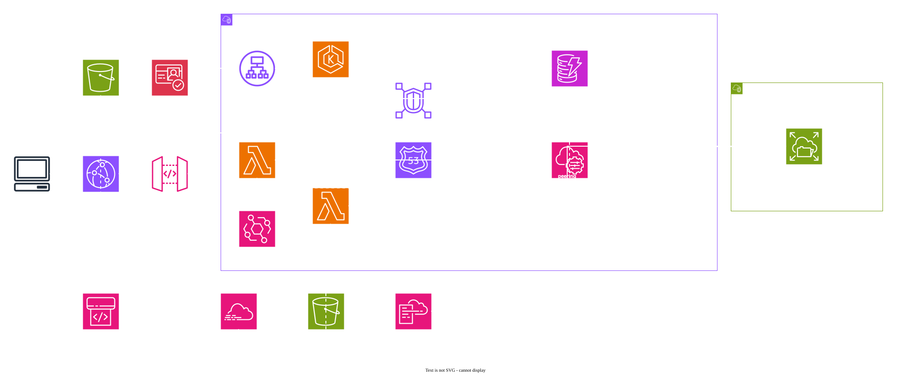

# VitalForge — Test Project

**Document:** Test Project  
**Region:** Any single AWS Region (this document uses **`eu-central-1`** as the example)  
**Duration:** Single 6-hour module

## Contents

1. [Task description](#1-task-description)
2. [Background](#2-background)
3. [Initial state](#3-initial-state)
4. [Architecture](#4-architecture)
5. [Stages](#5-stages)
6. [Tasks](#6-tasks)
7. [Common requirements](#71-common-requirements)
8. [Technical details](#8-technical-details)
9. [Service details](#9-service-details)
10. [Reference documents](#10-reference-documents)

---

## 1. Task Description

Rebuild VitalForge's on-prem fitness platform as a **cloud-native** architecture on AWS.

You must deliver:

1. **Authenticated public APIs on Amazon EKS** — meal logging, workout tracking, and member dashboards for coaches and athletes.
2. **Wearable sleep ingestion** — record nightly sleep sessions without loss.
3. **Runtime nutrition thresholds** — change validation rules without redeploying applications.
4. **Internal analytics scoring** — calorie balance and recovery metrics computed by a private service reachable only through **VPC Lattice**.
5. **Shared daily export files** — durable JSON summaries on **Amazon EFS** that the API can serve.
6. **Audit logging** — account activity captured with **AWS CloudTrail** (bootstrap from the provided template).
7. **CI/CD for the operations console** — uploading the console package alone completes deployment.

---

## 2. Background

**VitalForge** coaches **2,400 gym members** across eight locations. Members log meals and workouts; wearables upload sleep data overnight; coaches review dashboards and export daily summaries for nutrition check-ins.

### Problems (on-premises)

- The app server ran out of disk during a January challenge and **lost three days** of meal logs.
- Macro cut targets lived in a `.env` file — changing protein goals required **restarting every API pod** mid-week.
- Sleep uploads hit the public API directly; a misconfigured router once exposed member health data to the guest Wi‑Fi VLAN.
- Calorie scoring ran in the same process as the REST API; heavy batch recalculation **starved live dashboard reads**.
- Daily coach exports were copied from a shared SMB folder with no versioning — two coaches overwrote the same member file.

### Strategic goals

| Goal | Intent |
| ---- | ------ |
| Durable activity capture | Every meal, workout, and sleep session persisted before acknowledgement |
| Runtime thresholds | Adjust macro/sleep validation without redeploying pods |
| Role-based access | Coaches see all members; members see only their own data |
| Isolated analytics | Scoring service not reachable from the public internet |
| Shared export tree | One POSIX path per member for daily JSON exports |
| Observable operations | API and management events land in CloudTrail |
| Automated console delivery | Repeatable static releases |

### Target AWS building blocks

| Area | Services |
| ---- | -------- |
| Containers | Amazon EKS (`linux/arm64` node workloads) |
| Service networking | Amazon VPC Lattice |
| Serverless | AWS Lambda, Amazon API Gateway |
| Identity | Amazon Cognito; auth enforced by `wellness-api` |
| Configuration | AWS Systems Manager Parameter Store |
| Data | Amazon DynamoDB, Amazon EFS |
| Edge | Amazon CloudFront, AWS WAF |
| DNS (internal) | Amazon Route 53 private hosted zone |
| Audit | AWS CloudTrail, AWS CloudFormation |
| Delivery | CodePipeline, CodeBuild |

---

## 3. Initial State

You start from an **empty AWS account** (default VPC only). Nothing is pre-provisioned; you create every resource — including IAM roles, VPCs, EKS, CloudFront, Cognito, Lattice, and the console pipeline.

An architecture diagram is provided **for reference only** (§4).

**Provided artifacts** (`game-assets/` — local files only; not uploaded for you):

| Artifact | Notes |
| -------- | ----- |
| `wellness-api` | Application binary (EKS) |
| `analytics-engine` | Application binary (EKS, Lattice-only) |
| `sleep-ingest.zip` | Lambda deployment package (`provided.al2023`, `arm64`, handler `bootstrap`) |
| `daily-export.zip` | Lambda deployment package (`provided.al2023`, `arm64`, handler `bootstrap`; mounts EFS) |
| `console.zip` | Operations console (static) |
| `seed-users.json` | DynamoDB seed members |
| `thresholds-baseline.json` / `thresholds-cut-phase.json` | SSM threshold documents |
| `audit-bootstrap.yaml` | Small CloudFormation stack (CloudTrail bucket + trail) |
| `demo-users.txt` | Suggested Cognito users (coach / member) |

> **CAUTION:** Deploy all resources in **one** AWS Region of your choice. Examples in this document (ARNs, endpoints, screenshots) use **`eu-central-1`**.

---

## 4. Architecture



*[Figure] Target architecture overview (for reference only)*

### Flow summary

| Stage | Path |
| ----- | ---- |
| Edge & identity | CloudFront (+ WAF) → Cognito → API Gateway → ALB → `wellness-api` (EKS); CloudFront → S3 console (`/`) |
| Internal DNS | Route 53 private zone `vitalforge.internal` in `app-vpc` → Lattice service name for `analytics-engine` |
| Activity APIs | Authenticated members/coaches log meals and workouts via `wellness-api` → DynamoDB |
| Internal scoring | `wellness-api` → **VPC Lattice** → `analytics-engine` (EKS); not internet-routable |
| Sleep ingest | CloudFront → `POST /sleep` → API Gateway → `sleep-ingest` Lambda → DynamoDB |
| Thresholds | SSM Parameter Store → EKS pods and `sleep-ingest` (no redeploy on change) |
| Daily export | EventBridge schedule → `daily-export` Lambda → EFS `/exports/{user_id}/latest.json` |
| Export read | `wellness-api` mounts EFS (via access point) and serves `GET /api/export/{user_id}/latest` |
| Audit | CloudTrail (from `audit-bootstrap.yaml`) → S3; extend as needed |
| Console CI/CD | S3 (source) → CodePipeline → CodeBuild → S3 (console) ← CloudFront |

**Networking:** application workloads in **`app-vpc`** (EKS, ALB, Lambda ENIs); **EFS** only in **`files-vpc`**. Connect the two with **VPC peering** (NFS **2049** only from approved security groups). **`analytics-engine`** must be reachable from `wellness-api` through **VPC Lattice only** — not through the public ALB or API Gateway.

---

## 5. Stages

### Stage 1 — Audit bootstrap, identity, edge, and thresholds

Deploy the provided **`audit-bootstrap.yaml`** CloudFormation stack to create the CloudTrail S3 bucket and trail. Extend it if your design requires additional trails or log delivery.

Members and coaches authenticate with **Cognito** in the console. Protected **`/api/*`** routes are enforced by the provided **`wellness-api`** binary (Bearer JWT from Cognito for console users; see §9.1). API Gateway forwards API traffic to `wellness-api` — do **not** attach a Cognito JWT authorizer on the HTTP API (the provided binary performs auth).

Publish provided threshold documents to **SSM Parameter Store** under the prefix documented in §9.2. EKS pods and `sleep-ingest` must read thresholds without redeployment when parameters change.

Attach **AWS WAF** to CloudFront. Public access uses the **CloudFront distribution domain name** — no custom domain or domain registration is required.

Create a **Route 53 private hosted zone** `vitalforge.internal` associated with **`app-vpc`**. Register the Lattice service hostname (e.g. `analytics.vitalforge.internal`) for `analytics-engine`; `wellness-api` must call analytics through that internal name (§9.4).

### Stage 2 — EKS workloads, DynamoDB, and Lattice analytics

**Amazon EKS** hosts:

- **`wellness-api`** — meals, workouts, dashboards, export reads; DynamoDB access; calls `analytics-engine` over Lattice; mounts EFS for export files.
- **`analytics-engine`** — internal scoring only; reachable through a **VPC Lattice service network**; must not be exposed on the public ALB.

Load **`seed-users.json`** into DynamoDB. All application writes go through the provided binaries.

**EFS** lives in `files-vpc`. Peering connects `app-vpc` ↔ `files-vpc`. Use **EFS access points** with IAM authorization. Encryption in transit is required for EKS and Lambda mounts.

### Stage 3 — Sleep ingest, daily export, and console CI/CD

Wearables POST sleep sessions to **`POST /sleep`** (no JWT — device path). The Lambda validates duration against active SSM thresholds, writes to DynamoDB, and returns **`202`** on success.

**EventBridge** invokes **`daily-export`** on a schedule (or on demand via the API — §9.7). The function writes `exports/{user_id}/latest.json` on EFS.

Upload `console.zip` to the pipeline source bucket; **CodePipeline** / **CodeBuild** publish the static site and invalidate CloudFront.

---

## 6. Tasks

1. **Networking**
   - Create **`app-vpc`** (EKS, ALB, Lambda) and **`files-vpc`** (EFS only).
   - Inter-VPC EFS access via **VPC peering** only (not Transit Gateway).
   - Restrict NFS (**2049**) to approved security groups; no broad `files-vpc` routes in public subnets.
2. **Identity and API edge**
   - Coaches and members authenticate before protected routes.
   - Unauthenticated calls to protected routes must fail; **`GET /health`** and **`POST /sleep`** may remain public.
   - Role separation between `coach` and `member` (see §9.1).
   - One **CloudFront** distribution for console and APIs (paths in §9.9); **AWS WAF** web ACL on the distribution.
   - Public entry uses the CloudFront domain only — no registered domain required.
3. **DynamoDB**
   - Tables per §9.3; load **`seed-users.json`**.
4. **Configuration**
   - Publish provided threshold documents to **SSM Parameter Store** (§9.2).
   - EKS pods and `sleep-ingest` must read thresholds at runtime without redeployment when parameters change.
5. **EKS applications**
   - Run provided **`wellness-api`** and **`analytics-engine`** binaries as **`linux/arm64`** containers.
   - **`wellness-api`** behind the public ALB (auth in the binary — §9.1).
   - **`analytics-engine`** must not be exposed on the public ALB, API Gateway, or CloudFront.
6. **Service networking**
   - **VPC Lattice** service network connecting `wellness-api` → `analytics-engine` (§9.4).
   - Route 53 **private** hosted zone **`vitalforge.internal`** in `app-vpc`; register a Lattice hostname (e.g. `analytics.vitalforge.internal`).
   - Dashboard calls to analytics must use the internal Lattice hostname — not the public edge.
7. **EFS and exports**
   - **EFS** access point for the export tree in `files-vpc`; mount from `wellness-api` and `daily-export`.
   - Export path and JSON shape per §9.6; `wellness-api` serves **`GET /api/export/{user_id}/latest`**.
8. **Sleep ingestion**
   - API Gateway + Lambda on **`POST /sleep`** (also reachable through CloudFront).
   - Validate against active SSM thresholds before insert.
   - Responses: **`202`** success; **`400`** missing fields; **`422`** if duration below minimum or unknown `user_id`.
9. **Daily export workflow**
   - **EventBridge** schedule invokes **`daily-export`** for each member (or a batch you design).
   - Coach **`POST /api/members/{id}/export`** queues or triggers the same export path (§9.5).
   - Overwrite `exports/{user_id}/latest.json` on EFS on each successful run.
10. **Audit bootstrap**
    - Deploy **`audit-bootstrap.yaml`** and ensure CloudTrail delivers to the created bucket.
11. **Pipelines**
    - Console: uploading **`console.zip`** alone completes deployment (incl. CloudFront invalidation).

---

## 7.1 Common Requirements

| Theme | Expectation |
| ----- | ----------- |
| Security | System must be secure |
| Observability | Strong logging/monitoring earns extra credit |
| Cost | Prefer cost-effective designs |
| Resilience | Design for failure of single components |
| Latency | Dashboard reads within **0.5 seconds** at p95; other APIs within **0.8 seconds** at p95 |
| Audit | Management events visible in CloudTrail |

---

## 8. Technical Details

1. Deploy all resources in **one** AWS Region. This brief uses **`eu-central-1`** in examples only — any commercial Region that supports the required services is acceptable.
2. You start from an **empty account**; no bootstrap or provisioning script is provided.
3. Do **not** modify provided application binaries, `console.zip`, threshold JSON, Lambda zip packages, or `audit-bootstrap.yaml` semantics.
4. A Dockerfile is **not** provided — write your own to containerize each binary.
5. Compute for the provided applications: **Amazon EKS** and **Lambda**, both **`linux/arm64`**.
6. Inter-VPC connectivity for EFS must use **VPC peering** (not Transit Gateway).
7. Internal analytics calls must use **VPC Lattice** (not public ALB, NLB, or API Gateway).
8. Application configuration (non-secret) must come from **SSM Parameter Store**; use Secrets Manager or IAM roles for secrets as you design.
9. Data store: **DynamoDB** (not Aurora/RDS). After seed load, mutate data only through applications and workflows.
10. Exact resource names/placement are flexible; **security** and **availability** are assessed.
11. **Public entry point** is the CloudFront distribution domain name — no registered domain or public Route 53 zone required.
12. Deploy **`audit-bootstrap.yaml`** before or alongside other stacks — do not remove the trail it creates.
13. Protected `/api/*` routes must return **401** without credentials and enforce `coach` / `member` roles (**403** where applicable). Auth is implemented in **`wellness-api`** (platform checks use mock headers in §9.1); do not require an API Gateway JWT authorizer.
14. Route 53 is used for a **private** hosted zone in `app-vpc` only (Lattice internal hostname).
15. CloudFront origins (ALB, API Gateway, S3) must be created in the **same Region** as the application stack.

---

## 9. Service Details

### 9.1 Identity

| Item | Requirement |
| ---- | ----------- |
| User pool | Cognito; app client for the console |
| Groups | `coach`, `member` |
| API auth | Enforced by **`wellness-api`** on protected `/api/*` (not API Gateway JWT authorizer) |
| Public | `GET /health` and `POST /sleep` may be open |

Seed users (passwords in `game-assets/demo-users.txt`): one coach, three members. **Cognito usernames must match DynamoDB `user_id`** in `seed-users.json` (e.g. `member-demo-1`).

**Automated scoring auth:** Platform API checks do **not** use Cognito. They authenticate with mock headers on protected routes:

| Header | Example value |
| ------ | ------------- |
| `X-Dev-Sub` | `scoring-coach`, `member-demo-1` |
| `X-Dev-Groups` | `coach` or `member` |

The provided `wellness-api` binary accepts these headers on every deployment. Console users use Cognito Bearer JWTs as usual.

| Route | `coach` | `member` |
| ----- | ------- | -------- |
| `GET /api/members` | yes | no → **403** |
| `GET /api/members/{id}/dashboard` | yes (any member) | yes (own `id` only) → **403** for others |
| `POST /api/meals` | yes | yes (own `user_id` only) |
| `POST /api/workouts` | yes | yes (own `user_id` only) |
| `POST /api/members/{id}/export` | yes | no → **403** |
| `GET /api/export/{user_id}/latest` | yes (any) | yes (own only) |

Members are identified by `user_id` values from `seed-users.json` — the same usernames as Cognito (e.g. `member-demo-1`).

### 9.2 Configuration (SSM Parameter Store)

Publish threshold documents as **String parameters** (Standard tier) under prefix `/vitalforge/thresholds/`:

| Parameter | Source file | Fields |
| --------- | ----------- | ------ |
| `/vitalforge/thresholds/active` | `thresholds-baseline.json` or `thresholds-cut-phase.json` | JSON document (below) |

**Threshold document shape:**

| Field | Type | Notes |
| ----- | ---- | ----- |
| `version` | string | e.g. `baseline-2026` |
| `min_sleep_hours` | number | Sessions shorter → **422** on ingest |
| `protein_g_per_kg` | number | Used by `analytics-engine` |
| `calorie_deficit_target` | integer | Daily deficit goal (kcal) |
| `flags` | object | e.g. `{"cut_phase": false}` |

Provided files: `thresholds-baseline.json`, `thresholds-cut-phase.json`. `sleep-ingest` must stamp `thresholds_version` on each accepted session (DynamoDB attribute).

Applications read `/vitalforge/thresholds/active` at runtime (no redeploy when the parameter value changes).

**Connection hints** (competitors may add additional parameters):

| Parameter | Example | Consumer |
| --------- | ------- | -------- |
| `/vitalforge/connections/dynamodb_table_prefix` | `vitalforge` | EKS, Lambda |
| `/vitalforge/connections/analytics_lattice_url` | e.g. `http://analytics.vitalforge.internal` | `wellness-api` |
| `/vitalforge/connections/efs_mount_path` | `/mnt/exports` | `wellness-api`, `daily-export` — local EFS access-point mount (files at `{mount}/{user_id}/latest.json`) |

### 9.3 DynamoDB

All tables use on-demand billing unless you choose otherwise. Partition key names are exact.

#### Table `vitalforge-users`

| Attribute | Key | Type | Notes |
| --------- | --- | ---- | ----- |
| `user_id` | PK | string | e.g. `member-demo-1` |
| `display_name` | | string | |
| `coach_id` | | string | |
| `weight_kg` | | number | |
| `status` | | string | `ACTIVE` |

Seed from `seed-users.json`.

#### Table `vitalforge-meals`

| Attribute | Key | Type | Notes |
| --------- | --- | ---- | ----- |
| `user_id` | PK | string | |
| `meal_id` | SK | string | UUID |
| `logged_at` | | string | ISO-8601 |
| `calories` | | number | |
| `protein_g` | | number | |
| `description` | | string | |

#### Table `vitalforge-workouts`

| Attribute | Key | Type | Notes |
| --------- | --- | ---- | ----- |
| `user_id` | PK | string | |
| `workout_id` | SK | string | UUID |
| `logged_at` | | string | ISO-8601 |
| `duration_min` | | number | |
| `calories_burned` | | number | |
| `activity` | | string | e.g. `strength`, `cardio` |

#### Table `vitalforge-sleep`

| Attribute | Key | Type | Notes |
| --------- | --- | ---- | ----- |
| `user_id` | PK | string | |
| `session_id` | SK | string | UUID |
| `started_at` | | string | ISO-8601 |
| `ended_at` | | string | ISO-8601 |
| `duration_hours` | | number | |
| `thresholds_version` | | string | From SSM at ingest time |

### 9.4 VPC Lattice (analytics-engine)

| Item | Requirement |
| ---- | ----------- |
| Caller | `wellness-api` only |
| Target | `analytics-engine` HTTP listener |
| DNS | Route 53 **private** hosted zone `vitalforge.internal` in `app-vpc`; service hostname e.g. **`analytics.vitalforge.internal`** (resolves only inside the VPC) |
| Public exposure | **Forbidden** — no ALB listener, API Gateway route, or CloudFront origin may target `analytics-engine` |

No public Route 53 zone or registered domain is required. Marking and wearables use the **CloudFront distribution URL**.

**Internal request** (made by `wellness-api` when building a dashboard):

```
POST /internal/score
Content-Type: application/json

{
  "user_id": "member-demo-1",
  "window_days": 7
}
```

**Response `200`:**

```json
{
  "user_id": "member-demo-1",
  "calorie_balance": -420,
  "protein_progress_pct": 87,
  "sleep_score": 78,
  "thresholds_version": "baseline-2026"
}
```

`wellness-api` merges this object into the dashboard payload (§9.5).

### 9.5 REST API (`wellness-api`)

Base path behind CloudFront/API Gateway: `/api/…`

#### `GET /health`

| | |
| - | - |
| Auth | none |
| **200** | `{"status":"ok","service":"wellness-api"}` |

#### `GET /api/config/thresholds/version`

| | |
| - | - |
| Auth | coach or member |
| **200** | `{"version":"…","flags":{…}}` — mirrors active SSM document |

#### `GET /api/members`

| | |
| - | - |
| Auth | coach |
| **200** | `{"total":3,"members":[{"user_id":"…","display_name":"…"},…]}` — three seed members |

#### `GET /api/members/{id}/dashboard`

| | |
| - | - |
| Auth | coach (any id) or member (own id) |
| **200** | |

```json
{
  "user_id": "member-demo-1",
  "display_name": "…",
  "meals_today": 2,
  "workouts_today": 1,
  "analytics": {
    "calorie_balance": -420,
    "protein_progress_pct": 87,
    "sleep_score": 78,
    "thresholds_version": "baseline-2026"
  }
}
```

#### `POST /api/meals`

| | |
| - | - |
| Auth | coach or member (own `user_id`) |
| Body | `{"user_id":"…","calories":650,"protein_g":42,"description":"…"}` |
| **201** | `{"meal_id":"…","user_id":"…","calories":650}` |
| **400** | missing required fields |
| **403** | member posting for another user |

#### `POST /api/workouts`

| | |
| - | - |
| Auth | coach or member (own `user_id`) |
| Body | `{"user_id":"…","duration_min":45,"calories_burned":320,"activity":"cardio"}` |
| **201** | `{"workout_id":"…","user_id":"…","calories_burned":320}` |

#### `POST /api/members/{id}/export`

| | |
| - | - |
| Auth | coach |
| **202** | `{"user_id":"…","status":"queued"}` — triggers or queues `daily-export` for that member |

#### `GET /api/export/{user_id}/latest`

| | |
| - | - |
| Auth | coach (any) or member (own) |
| **200** | JSON body identical to §9.6 export file |
| **404** | export not yet written |

### 9.6 EFS export file

Path on EFS (via access point root):

```
exports/{user_id}/latest.json
```

**File content:**

```json
{
  "user_id": "member-demo-1",
  "generated_at": "2026-08-30T06:00:00Z",
  "meals_count": 14,
  "workouts_count": 5,
  "avg_sleep_hours": 7.2,
  "thresholds_version": "baseline-2026"
}
```

`daily-export` overwrites this file on each successful run for the member.

### 9.7 Sleep ingest (`POST /sleep`)

| | |
| - | - |
| Auth | none (wearable path) |
| Body | `{"user_id":"…","started_at":"…","ended_at":"…"}` |
| **202** | `{"session_id":"…","user_id":"…","duration_hours":7.5,"thresholds_version":"…"}` |
| **400** | missing fields |
| **422** | unknown `user_id`, or `duration_hours` below active `min_sleep_hours` |

`duration_hours` is computed by the Lambda from `started_at` / `ended_at`.

### 9.8 CloudTrail bootstrap

`audit-bootstrap.yaml` creates at minimum:

| Resource | Purpose |
| -------- | ------- |
| S3 bucket | CloudTrail log delivery (encrypted, blocked public access) |
| Trail | Multi-region trail logging management events |

Competitors may add data events or additional buckets; do not disable the trail the template creates.

### 9.9 CloudFront path routing

| Path pattern | Origin |
| ------------ | ------ |
| `/` , `/console/*` | S3 (private, OAC) |
| `/health` | API origin → `wellness-api` |
| `/api/*` | API origin → `wellness-api` |
| `/sleep` | API origin → API Gateway → `sleep-ingest` |

**AWS WAF** web ACL associated with the distribution (rate-based rules recommended on `/api/*` and `/sleep`).

### 9.10 Console CI/CD

| Step | Expectation |
| ---- | ----------- |
| Source | S3 bucket; uploading **`console.zip`** alone triggers the pipeline |
| Build | CodeBuild extracts and publishes to the console origin bucket |
| Deploy | CloudFront invalidation for `/*` |

### 9.11 Binary environment variables

Both EKS binaries listen on port **8080**.

Both Lambda packages are **custom-runtime** Go binaries (not interpreted runtimes). Deploy unchanged zips from `game-assets/`.

#### `sleep-ingest` (provided Lambda)

| | |
| - | - |
| Runtime | `provided.al2023` (or `provided.al2`) |
| Architecture | `arm64` |
| Handler | `bootstrap` |
| Package | `sleep-ingest.zip` (root contains executable `bootstrap` only) |
| Trigger | API Gateway `POST /sleep` (also reachable via CloudFront) |
| VPC | Place in **`app-vpc`** subnets with DynamoDB access (interface endpoints or NAT per your design) |

Environment: `DYNAMODB_TABLE_PREFIX`, `THRESHOLDS_SSM_PARAM` (default `/vitalforge/thresholds/active`) or `THRESHOLDS_CONFIG_PATH` for local smoke tests.

#### `daily-export` (provided Lambda)

| | |
| - | - |
| Runtime | `provided.al2023` (or `provided.al2`) |
| Architecture | `arm64` |
| Handler | `bootstrap` |
| Package | `daily-export.zip` (root contains executable `bootstrap` only) |
| Trigger | EventBridge schedule (and/or on-demand invoke from coach export flow) |
| VPC | Place in **`app-vpc`** subnets; attach **EFS** via access point (§9.6) with encryption in transit |

Environment: `DYNAMODB_TABLE_PREFIX`, `EFS_MOUNT_PATH` (set to the Lambda **local mount path**, e.g. `/mnt/exports`), `THRESHOLDS_SSM_PARAM` (default `/vitalforge/thresholds/active`) or `THRESHOLDS_CONFIG_PATH` for local smoke tests. Optional `EFS_EXPORT_SUBDIR=exports` only if the mount is **above** the exports directory.

#### `wellness-api` (EKS)

Environment: `PORT`, `DYNAMODB_TABLE_PREFIX`, `ANALYTICS_LATTICE_URL`, `EFS_MOUNT_PATH`, optional `EFS_EXPORT_SUBDIR`, optional `COGNITO_*`, optional `VITAL_MEMBER_ID` (defaults to `member-demo-1` for member scoping).

#### `analytics-engine` (EKS)

Environment: `PORT`, `DYNAMODB_TABLE_PREFIX`, threshold path via `THRESHOLDS_CONFIG_PATH` or SSM integration you implement.

---

## 10. Reference Documents

| Document | Location |
| -------- | -------- |
| Architecture diagram | `assets/architecture.svg` |
| Seed users | `game-assets/seed-users.json` |
| Threshold documents | `game-assets/thresholds-*.json` |
| Audit bootstrap | `game-assets/audit-bootstrap.yaml` |
| Demo users | `game-assets/demo-users.txt` |
